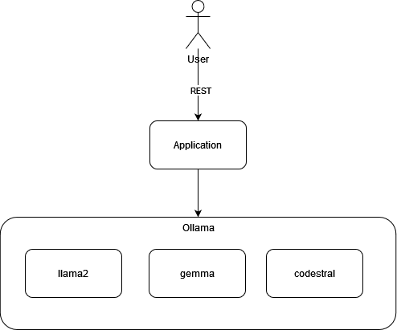

# The problem
How it's possible to integrate an existing llm (Large Language Model) using [Ollama](https://github.com/ollama/ollama) with [Spring](https://spring.io/) ?

Here the basic architecture:



# The solution
Using [Spring-AI](https://spring.io/projects/spring-ai) ! 
This module simplify integration with existing llm models, and also with ollama, giving us the flexibility to try different llm models, locally, for free.

# Setup
1. Install [Ollama](https://github.com/ollama/ollama) locally (or one of your servers)
2. Be sure to enable CUDA for your NVIDIA graphic card for better performance
3. Choose which model to use (default here llama3:latest ) and pull it using ollama
4. Configure application in application.properties (in particular vectorstore.path !) 
4. Run the example application (default on port 8080 )

# Test setup
I'm using a NVIDIA GEFORGE GTX 1050 Ti

# Hello world

## Introduction
We want to try llm capabilities to create an hello world program, in python.

A new api is available with GET on http://localhost:8080/ai/ollama/

## Result
Example: GET http://localhost:8080/ai/ollama/chat?message='Create a Python Hello World program'
Result: 

>"Here is a simple "Hello, World!" program in Python:
>```
>print("Hello, World!")
>```
>Let me explain what's going on:
>
>* `print()` is a built-in function that prints its argument to the console.
>* The string `"Hello, World!"` is the argument being passed to the `print()` function.
>
>To run this program, save it to a file with a `.py` extension (e.g., `hello.py`) and then execute it using Python:
>```
>$ python hello.py
>Hello, World!
>```
>Alternatively, you can also run this program directly in a Python interpreter or IDE:
>```
>>>> print("Hello, World!")
>Hello, World!
>```
>That's it! This is the classic "Hello, World!" program that gets you started with programming in Python."

Time: in my setup, 61s to generate this answer.

# Hello world with a prompt

## Introduction
We want to try llm capabilities to create an hello world program, in java, but this time using a prompt template.
In this way, we can instruct llm to understand correctly user's input. 


## Result
Example: GET http://localhost:8080/ai/ollama/chat/code?message='Create a Java Hello World program'
Result:

>Here is the Java "Hello World" program that meets your requirements:
>
>```java
>// HelloWorld.java - A simple Java program that prints "Hello, World!" to the console.
>
>public class HelloWorld {
>    public static void main(String[] args) {
>        // Print "Hello, World!" to the console.
>        System.out.println("Hello, World!");
>    }
>}
>```
>
>This code is a basic Java program that prints "Hello, World!" to the console when run. The `main` method is the entry point of the program, and it uses the `System.out.println` method to print the message.
>
>**Documentation:**
>
>* This program is written in Java.
>* It defines a class called `HelloWorld`.
>* The `main` method is the entry point of the program.
>* The program prints "Hello, World!" to the console using `System.out.println`.
>
>This code should compile and run without any issues. Let me know if you have any questions or need further assistance!

Time: in my setup, 87 seconds to generate this answer.

# Ask question about a document

## Introduction
We want to try llm capabilities not only to generate code, but also to extend context using RAG (retrieval augmented generation) and ask questions about these documents

## Result
Example: GET http://localhost:8080/ai/ollama/chat/rag?message='Who is the author of the document?'
Result:

> According to the documents, the author's name is John Doe.

Time: in my setup, 7 seconds.


# Conclusion
It's possible to use locally (full offline!) every open source llm model, provided by Ollama and provide an user endpoint using spring to a frontend or other application.
The real limitation is the hardware, to run more powerful models and get more quickly answers.
